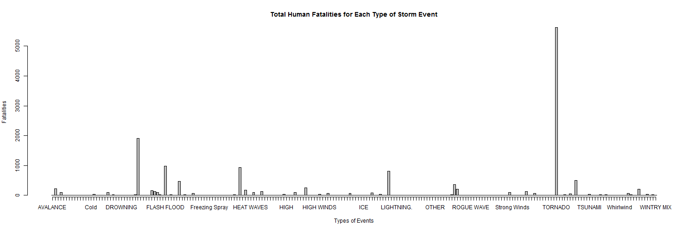
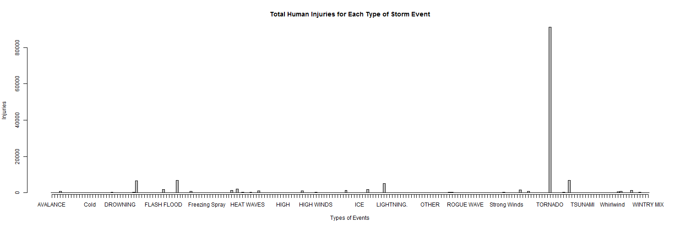
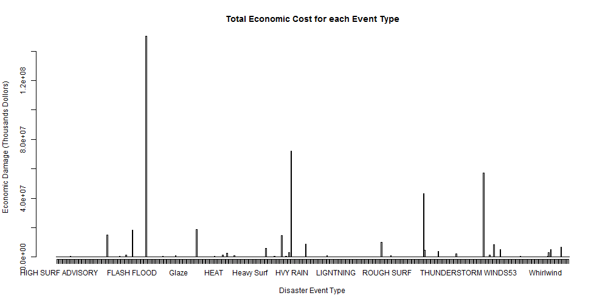

Reproducible Research: Project 2 Storm Data Analysis
====================================

## Introduction
Storms and other severe weather events can cause both public health and economic problems for communities and municipalities. Many severe events can result in fatalities, injuries, and property damage, and preventing such outcomes to the extent possible is a key concern.
This project involves exploring the U.S. National Oceanic and Atmospheric Administration's (NOAA) storm database. This database tracks characteristics of major storms and weather events in the United States, including when and where they occur, as well as estimates of any fatalities, injuries, and property damage.

The Data provided will be processed, cleaned, and anlyzed to determine th emost destructive storm types for both human casualties and economic impact.

## Data
Data Source: 
https://d396qusza40orc.cloudfront.net/repdata%2Fdata%2FStormData.csv.bz2

 - **EVTYPE:**  Event Type
 - **FATALITIES:** Number of human fatalities due to event
 - **INJURIES:** Number of human injuries due to event
 - **PROPDMG:** Property Damage in USD
 - **PROPDMGEXP:**  Magnitude of Property Damage (Thousands, Millions) USDs
 - **CROPDMG:** Crop Damage in USD
 - **CROPDMGEXP:** Magnitude of Crop Damage (Thousands, Millions) USDs

 
### Data Processing
Download the zip file and read into a dataframe

```{r warning = FALSE}
RawData <- read.csv("StormData.csv.bz2", stringsAsFactors = FALSE)
library(ggplot2)
library(plyr)


```
The raw data file has 37 columns with over 9 million rows of entries. The raw data will be cleaned to gather a subset of the information to answer the questions in concern.
The columns to be extracted are EVTYPE, FATALITIES, INJURIES, PROPDMG, PROPDMGEXP, CROPDMG, and CROPDMGEXP.
The dollar values for property and crop damage will be converted to their numeric value and a total damage column will be added.

```{r}
## Derive Required Variables from Raw Data
subsetColumns <- c(EventType = 8, Fatalities = 23, Injuries = 24, PropertyDamage = 25, PropertyDamageExp = 26, CropDamage = 27, CropDamageExp = 28)
DataSet <- RawData[subsetColumns]
names(DataSet) <- names(subsetColumns)

## Remove the rows that have 0 in all four variables.
DataSet <- DataSet[!(DataSet$Fatalities == 0 & DataSet$Injuries == 0 & DataSet$PropertyDamage == 0 & DataSet$CropDamage == 0), ]

## Convert the Damage Dollar Values
factor <- as.factor(DataSet$PropertyDamageExp)
levels(factor) <- c(1, 1, 1, 1, 100, 1000, 10000, 100000, 1000000, 10000000, 1000000000, 100, 100, 1000, 1000000, 1000000)
DataSet$PropertyDamage <- DataSet$PropertyDamage * as.numeric(as.character(factor))

factor <- as.factor(DataSet$CropDamageExp)
levels(factor) <- c(1, 1, 1, 1000000000, 1000, 1000, 1000000, 1000000)
DataSet$CropDamage <- DataSet$CropDamage * as.numeric(as.character(factor))
DataSet <- DataSet[c(1, 2, 3, 4, 6)]

```


### Results: Human Casualties
In this section, the data will be analyzed to determine which storm event causes the greates fatalities and injuries to humans.

```{r warning = FALSE}
HumanToll <- aggregate(DataSet[c(2, 3)], list(DataSet$EventType), sum)
names(HumanToll)[1] <- "EventType"

##Remove any Event Type without Injury or Fatality
HumanToll <- HumanToll[!(HumanToll$Fatalities == 0 & HumanToll$Injuries == 0), ]

## Chart the Fatality Values for each Storm Event Type
barplot(HumanToll$Fatalities, axis.lty = 1, names.arg = HumanToll$EventType, 
        xlab = "Types of Events", ylab = "Fatalities", 
        main = "Total Human Fatalities for Each Type of Storm Event")

## Chart the Injury Values for each Storm Event Type
barplot(HumanToll$Injuries, axis.lty = 1, names.arg = HumanToll$EventType,
        xlab = "Types of Events", ylab = "Injuries", 
        main = "Total Human Injuries for Each Type of Storm Event")
```
 


It can be determined that for both cases, when when measuring **fatality** rates and **injury** rates, **Tornados** cause the greatest damage to human casualties.
Tornadoes have causes 5,633 total cases of fatalities and 91,346 cases of injuries.

```{r warning = FALSE}
HumanToll[HumanToll$Fatalities == max(HumanToll$Fatalities), 1]
max(HumanToll$Fatalities)

HumanToll[HumanToll$Injuries == max(HumanToll$Injuries), 1]
max(HumanToll$Injuries)
```

### Results: Economic Casualties
In this section, the data will be analyzed to determine which storm event causes the greates economic consequence

```{r warning = FALSE}
DataSet$TotalDamage <- (DataSet$PropertyDamage + DataSet$CropDamage)/1000
damage <- aggregate(DataSet[6], list(DataSet$EventType), sum)
names(damage)[1] <- "EventType"

barplot(damage$TotalDamage, axis.lty = 1, names.arg = damage$EventType, 
        xlab = "Disaster Event Type", ylab = "Economic Damage (Thousands Dollors)", 
        main = "Total Economic Cost for each Event Type")

```


From the analysis above, it can be derived that although **Tornados** may cause the greates human casualties, **Floods** carry the gretest damage when considering economic consequences.
From this data set, *Floods* have shown to have caused **$150,319,678** in damage.

```{r warning = FALSE}

damage[damage$TotalDamage == max(damage$TotalDamage), 1]
max(damage$TotalDamage)		
		
```
